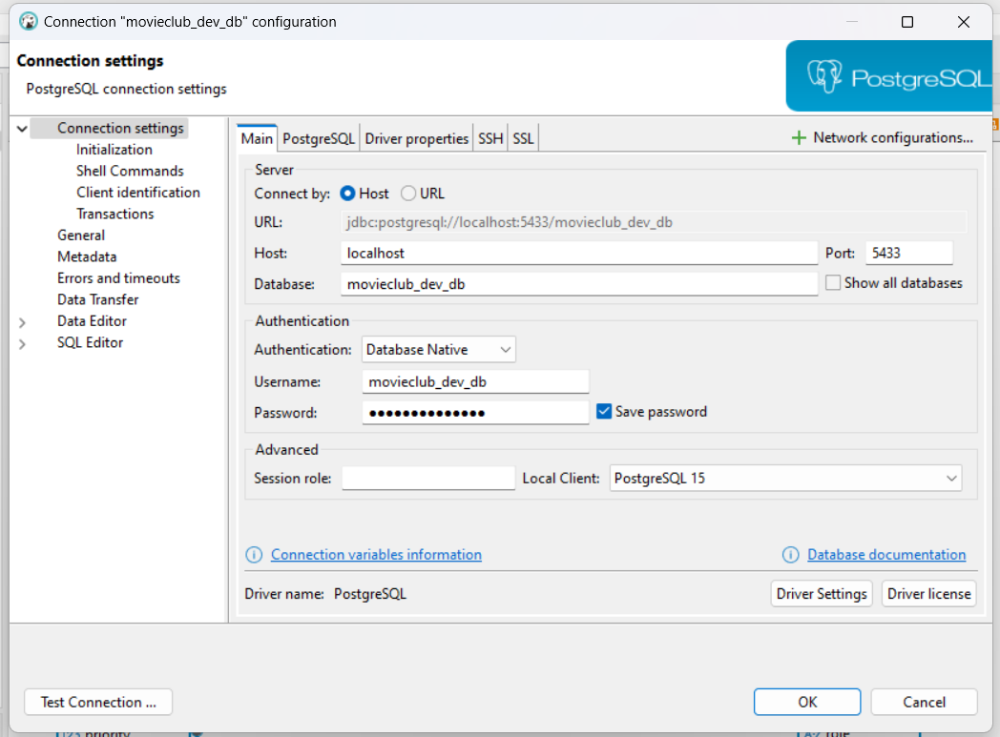

# 4.3 Local Tools

# Set up DBeaver ✅

## **1. Test connectivity** from WSL2

```bash
psql -h localhost -U bookclub_db -d bookclub_db
```

## **2. Find host IP address**

Since you're using Docker in WSL2, the database will be accessible via the WSL2 host machine. Check the IP address of the WSL2 instance (or Docker host):

```bash
hostname -I
```

## **3. In DBeaver**

1. Launch **DBeaver**.
2. Click **Database** → **New Database Connection**.
3. **Select PostgreSQL** as the database type and click **Next**.
4. **Enter the connection details**:
    - **Host**: Use `localhost` or the WSL2/Docker host IP.
    - **Port**: `5432` (or the port mapped in your Docker Compose file).
5. Click **Test Connection**:
    - If the connection fails, verify the host, port, username, and password.

In case of errors make sure to recheck:

- port
- credentials



Connection successful:


Resulting ER Diagram:

